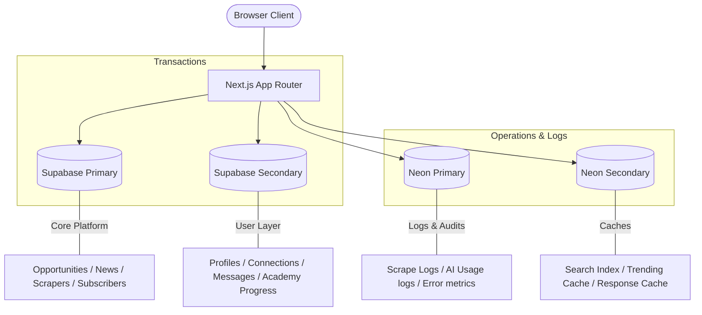

<p align="center">
  
</p>

<h1 align="center">SiliconPath</h1>

<p align="center">
  <strong>The open career aggregator & self-guided learning platform for the Indian semiconductor, VLSI, and hardware engineering industry.</strong><br>
  No friction. No login required. Aggregating academic research and industry opportunities in one place.
</p>

<p align="center">
  <a href="https://siliconpath.vercel.app">Live Application</a> • 
  <a href="#key-features">Key Features</a> • 
  <a href="#system-architecture">System Architecture</a> • 
  <a href="#quick-start">Quick Start</a> • 
  <a href="./docs/">Documentation</a>
</p>

---

## 🚀 Overview

**SiliconPath** is a high-performance web platform built to aggregate career pathways and structured learning curricula for the Indian electronics and semiconductor sector. It serves as a consolidated portal for students, researchers, and core engineers to bypass fragmented institutional portals and access JRFs, PhDs, private sector roles, and self-taught technical tracks.

### The Problem We Solve:
- **Opportunity Fragmentation:** JRFs, fellowships, and core jobs are scattered across dozens of PSU, institutional (DRDO, ISRO, CSIR, IITs), and private websites.
- **Curriculum & Guidance Deficit:** Students looking to break into VLSI face expensive training institutes or chaotic YouTube structures with no clear path or verified content.

---

## ✨ Key Features

### 1. Unified Opportunity Aggregator
Surfaces curated postings across 7 distinct categories:
* **Junior & Senior Research Fellowships (JRF/SRF)** in electronics, VLSI, and hardware systems.
* **Fully Funded PhDs** both in premier Indian institutions (IITs, IISc) and global options.
* **Government & PSU Scientist Positions** (DRDO, ISRO, CSIR, etc.).
* **Private Sector VLSI Roles** (RTL, Physical Design, Verification, DFT).
* **International Fellowships & Internships**.

### 2. VLSI Academy Learning Path
A structured, sequential, 7-stage curriculum built using verified, free YouTube content with strict creator attributions and interactive gating:
1. **Digital Logic Fundamentals** (Number systems, combinational/sequential logic, FSMs)
2. **Verilog HDL** (Gate-level, behavioral, testbenches)
3. **SystemVerilog for Verification** (OOP, randomization, SVA, functional coverage)
4. **Universal Verification Methodology (UVM)** (UVM hierarchy, sequences, factory, TLM)
5. **RTL Design & Synthesis** (Synthesizable RTL, CDC, SDC constraints, Yosys synthesis)
6. **Physical Design & Backend** (OpenLane flow, floorplanning, placement, CTS, routing, signoff)
7. **VLSI Interview Preparation** (Technical MCQs, coding rounds, company patterns)

*Gating Mechanism:* A track unlocks only after the user passes the preceding track's comprehensive assessment ($\ge 70\%$ score). If a user is not logged in, progress is saved in `LocalStorage`.

### 3. AI-Powered Fallback Matcher & Parsers
* **Structured Parsing:** Robust extraction from unstructured PDF/HTML listings (e.g., DRDO advertisements) converting text to strict JSON.
* **Dynamic Fallback Chain:** Resolves queries sequentially across providers (Groq, OpenRouter, Cloudflare, Gemini, Bedrock, HuggingFace) to ensure maximum uptime.
* **Match Scoring:** Intelligently matches opportunities against user qualifications, GATE/NET status, and preferred locations.

---

## 🗄️ System Architecture

SiliconPath uses a split-database layout across **4 database instances** to optimize caching, transactional security, and analytical write loads:



---

## 🛠️ Quick Start (Local Development)

### Prerequisites:
- Node.js (v18+)
- **pnpm** (preferred package manager)

### 1. Clone & Setup
```bash
git clone https://github.com/amitkr26/SiliconPath.git
cd SiliconPath/electrobridge
```

### 2. Install Dependencies
```bash
pnpm install
```

### 3. Environment Configuration
Copy the example environment template:
```bash
cp .env.local.example .env.local
```
Update `.env.local` with your database connection strings, Supabase keys, and AI provider tokens.

### 4. Apply Database Migrations
Run schema and content seed migrations on your Supabase instance:
```bash
npx supabase db push
```

### 5. Start Development Server
```bash
pnpm dev
```
Open [http://localhost:3000](http://localhost:3000) to view the application locally.

---

## 📚 Documentation Directory

Detailed technical implementation documents are available in the [`docs/`](./docs/) directory:

- 🏗️ [**Architecture Guide**](./docs/ARCHITECTURE.md) - Deep dive into database split and caching.
- 🗄️ [**Data Models**](./docs/DATA_MODEL.md) - Full database schema tables and relationships.
- 🔌 [**API Reference**](./docs/API_REFERENCE.md) - Internal REST routes and scraper scripts.
- 🚀 [**Deployment & Cron**](./docs/DEPLOYMENT.md) - Serverless cron configurations and pipeline.
- 🔐 [**Security Specs**](./docs/SECURITY.md) - PostgREST, RLS policies, and sanitization models.
- 🤝 [**Contributing**](./docs/CONTRIBUTING.md) - Coding style, linting rules, and contributions.

---

## 📄 License
This project is licensed under the [MIT License](./LICENSE).
