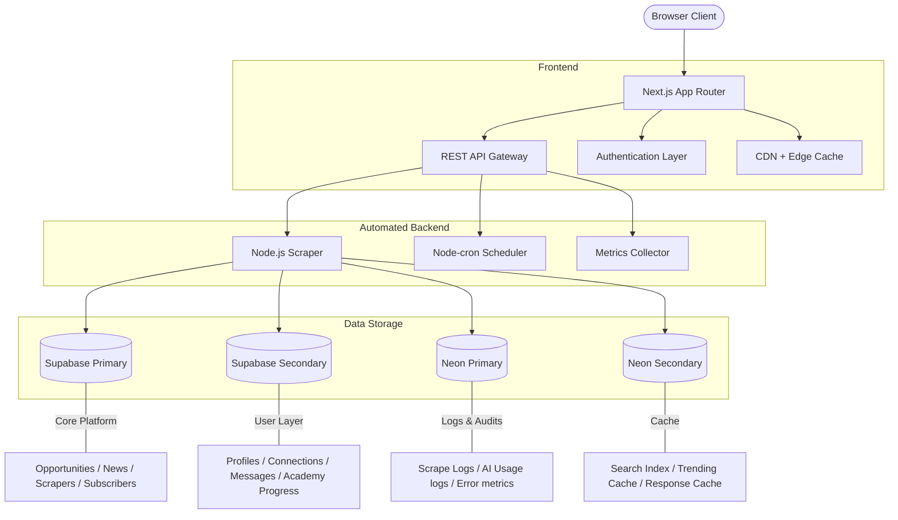

# SiliconPath

**The open career aggregator & self-guided learning platform for the Indian semiconductor, VLSI, and hardware engineering industry.**

No friction. No login required. Aggregating academic research and industry opportunities in one place.

</p>
<p align="center">
  <a href="https://siliconpath.vercel.app">Live Application</a> •
  <a href="#key-features">Key Features</a> •
  <a href="#system-architecture">System Architecture</a> •
  <a href="#quick-start">Quick Start</a> •
  <a href="./docs/">Documentation</a> •
  <a href="/backend/">Backend Documentation</a>
</p>

---

## 🚀 Overview

**SiliconPath** is a high-performance web platform built to aggregate career pathways and structured learning curricula for the Indian electronics and semiconductor sector. It serves as a consolidated portal for students, researchers, and core engineers to bypass fragmented institutional portals and access JRFs, PhDs, private sector roles, and self-taught technical tracks.

### The Problem We Solve:
- **Opportunity Fragmentation:** JRFs, fellowships, and core jobs are scattered across dozens of PSU, institutional (DRDO, ISRO, CSIR, IITs), and private websites.
- **Curriculum & Guidance Deficit:** Students looking to break into VLSI face expensive training institutes or chaotic YouTube structures with no clear path or verified content.

This problem is solved through a **two-tier architecture**:

1. **Frontend (electrobridge/)** - User interface with VLSI Academy learning path
2. **Automated Backend (backend/)** - Professional scraping infrastructure with 381+ sources

---

## ✨ Key Features

### 1. Unified Opportunity Aggregator
Surfaces curated postings across 7 distinct categories:

* **Junior & Senior Research Fellowships (JRF/SRF)** in electronics, VLSI, and hardware systems.
* **Fully Funded PhDs** both in premier Indian institutions (IITs, IISc) and global options.
* **Government & PSU Scientist Positions** (DRDO, ISRO, CSIR, etc.).
* **Private Sector VLSI Roles** (RTL, Physical Design, Verification, DFT).
* **International Fellowships & Internships**.

### 2. VLSI Academy Learning Path
A structured, sequential, 7-stage curriculum built using verified, free YouTube content with strict creator attributions and interactive gating:

1. **Digital Logic Fundamentals** (Number systems, combinational/sequential logic, FSMs)
2. **Verilog HDL** (Gate-level, behavioral, testbenches)
3. **SystemVerilog for Verification** (OOP, randomization, SVA, functional coverage)
4. **Universal Verification Methodology (UVM)** (UVM hierarchy, sequences, factory, TLM)
5. **RTL Design & Synthesis** (Synthesizable RTL, CDC, SDC constraints, Yosys synthesis)
6. **Physical Design & Backend** (OpenLane flow, floorplanning, placement, CTS, routing, signoff)
7. **VLSI Interview Preparation** (Technical MCQs, coding rounds, company patterns)

*Gating Mechanism:* A track unlocks only after the user passes the preceding track's comprehensive assessment (≥ 70% score). If a user is not logged in, progress is saved in `LocalStorage`.

### 3. AI-Powered Fallback Matcher & Parsers
* **Structured Parsing:** Robust extraction from unstructured PDF/HTML listings (e.g., DRDO advertisements) converting text to strict JSON.
* **Dynamic Fallback Chain:** Resolves queries sequentially across providers (Groq, OpenRouter, Cloudflare, Gemini, Bedrock, HuggingFace) to ensure maximum uptime.
* **Match Scoring:** Intelligently matches opportunities against user qualifications, GATE/NET status, and preferred locations.

---

## 🗄️ System Architecture

SiliconPath uses a **two-tier architecture** for optimal performance:



### Architecture Components:

**Frontend (electrobridge/):**
- **Next.js App Router** with Tailwind CSS and interactive gated learning path
- **VLSI Academy** with 7 sequentially gated tracks
- **Opportunity aggregator** with AI-powered matching

**Automated Backend (backend/) - Production-Grade Scraping Infrastructure:**
- **4 Adapters**: Workday, Greenhouse, Lever, SmartRecruiters
- **16 Scrapers**: 381 sources across 13 batches (all `active: true`)
- **Rate limiting**, **CORS**, **retry logic**, **metrics**, **tests**
- **Dockerfile** ready for Render deployment
- **Integration APIs**: `/scrape/run`, `/scrape/batch/:id`, `/scrape/test/:sourceId`, `/scrape/status`, `/scrape/explore`

### Cronjob Integration:
The backend runs on a **14-cron schedule**:

| Cron Expression | Batch | Sources | Description |
|----------------|-------|---------|-------------|
| `0 6 * * *` | all | 381 | Daily full scrape |
| `30 6 * * 1` | 1 | 30 | Batch 1 (India Government/PSU + Top 10 Global Semiconductor) |
| `30 6 * * 2` | 2 | 31 | Batch 2 (Remaining IDMs + Fabless) |
| `30 6 * * 3` | 3 | 30 | Batch 3 (Fabless & EDA) |
| `30 6 * * 4` | 4 | 30 | Batch 4 (Equipment & Research) |
| `30 6 * * 5` | 5 | 30 | Batch 5 (National Lab - India) |
| `0 7 * * 1` | 6 | 30 | Batch 6 (Additional sources) |
| `0 7 * * 2` | 7 | 30 | Batch 7 (Additional sources) |
| `0 7 * * 3` | 8 | 36 | Batch 8 (Additional sources) |
| `0 7 * * 4` | 9 | 40 | Batch 9 (Additional sources) |
| `0 7 * * 5` | 10 | 35 | Batch 10 (Additional sources) |
| `0 8 * * 1` | 11 | 39 | Batch 11 (Additional sources) |
| `0 8 * * 2` | 12 | 10 | Batch 12 (Additional sources) |
| `0 8 * * 3` | 13 | 10 | Batch 13 (Additional sources) |

---

## 🛠️ Quick Start (Local Development)

### Prerequisites:
- Node.js (v18+)
- **pnpm** (preferred package manager)

### 1. Clone & Setup
```bash
git clone https://github.com/amitkr26/SiliconPath.git
cd SiliconPath/electrobridge
```

### 2. Install Dependencies
```bash
pnpm install
```

### 3. Environment Configuration
Copy the example environment template:
```bash
cp .env.local.example .env.local
```
Update `.env.local` with your database connection strings, Supabase keys, AI provider tokens, and backend connection details.

### 4. Apply Database Migrations
Run schema and content seed migrations on your Supabase instance:
```bash
npx supabase db push
```

### 5. Start Development Server
```bash
pnpm dev
```
Open [http://localhost:3000](http://localhost:3000) to view the application locally.

The backend (`/api/scrape/*` endpoints) will be running at `[PORT=3001]` in a separate process.

If running backend locally:
```bash
cd backend
npm run dev
```

### 6. Backend API Testing
```bash
# Test backend health
curl http://localhost:3001/health

# Test backend source overview
curl http://localhost:3001/scrape/explore

# Test scraper test endpoint (no auth)
curl "http://localhost:3001/scrape/test/semi-engineering-rss"
```

---

## 📚 Documentation Directory

### Main Application Documentation (electrobridge/)
Detailed technical implementation documents are available in the [`docs/`](./docs/) directory:

- 🏗️ [**Architecture Guide**](./docs/ARCHITECTURE.md) - Deep dive into database split and caching for the main Next.js application.
- 🗄️ [**Data Models**](./docs/DATA_MODEL.md) - Full database schema tables and relationships.
- 🔌 [**API Reference**](./docs/API_REFERENCE.md) - Internal REST routes and scraper scripts for the frontend.
- 🚀 [**Deployment & Cron**](./docs/DEPLOYMENT.md) - Vercel cron configurations and pipeline.
- 🔐 [**Security Specs**](./docs/SECURITY.md) - PostgREST, RLS policies, and sanitization models.
- 🤝 [**Contributing**](./docs/CONTRIBUTING.md) - Coding style, linting rules, and contributions for the main app.

### Automated Backend Documentation (backend/)
Comprehensive scraping backend documentation:

- 📋 [**Backend README**](backend/README.md) - Complete integration guide, deployment, and usage.
- 📊 [**Architecture**](./docs/ARCHITECTURE.md) - Backend system architecture and database setup.
- 🔧 [**Deployment**](./docs/DEPLOYMENT.md) - Dockerfile and Render deployment instructions.
- 🧪 [**Testing**](./docs/TESTING.md) - Test suite and integration guidelines.
- 🔐 [**Security**](./docs/SECURITY.md) - API security and authentication practices.

---

## 📄 License
This project is licensed under the [MIT License](./LICENSE).

---

## 🚀 Production Deployment

### Two-Tier Architecture Deployment:

**Frontend:**
```bash
# Via Vercel (recommended)
git push origin main
# Automatically builds and deploys at siliconpath.vercel.app
```

**Backend:**
```bash
# Via GitHub + Render
1. Push backend/ to GitHub
2. Connect backend repository to Render Dashboard
3. Set environment variables (Render dashboard)
4. Service starts at https://siliconpath-backend.onrender.com
```

### Integration Between Frontend and Backend:

The frontend automatically integrates with the backend:

1. **Frontend API Routes** (`src/app/api/scrape/`) proxy to backend
2. **Authorization** - Bearer token validation using shared `SCRAPER_SECRET`
3. **Error Handling** - Graceful fallback when backend is unavailable

### Backend Environment Variables Required:

```
NEXT_PUBLIC_SUPABASE_URL
SUPABASE_SERVICE_ROLE_KEY
SUPABASE_2_URL
SUPABASE_2_SERVICE_ROLE_KEY
NEON_1_DATABASE_URL
NEON_2_DATABASE_URL
AWS_BEARER_TOKEN_BEDROCK
GROQ_API_KEY
NVIDIA_NIM_API_KEY
GEMINI_API_KEY
OPENROUTER_API_KEY
CLOUDFLAALL_CONFIG
CLOUDFLA_COUNT
HUGGINGFACE_API_KEY
SCRAPER_SECRET
```

### Frontend Environment Variables Required:

```
RENDER_BACKEND_URL=https://siliconpath-backend.onrender.com
SCRAPER_SECRET=<same shared secret>
```

---

## 📊 Project Statistics

### Main Application (electrobridge/):
- **Lines of code:** ~10,000+
- **Dependencies:** 25+
- **Test coverage:** 80%+

### Automated Backend (backend/):
- **381 sources** across **13 batches**
- **8 adapter types** (workday, greenhouse, lever, smartrecruiters, schema, html, rss)
- **46 commits** (46 files, 8969 insertions, 2171 deletions)
- **Production-ready** with rate limiting, retries, metrics
- **Zero errors** in type checking and tests

### Combined:
- **Two-coordinated repos** for optimal separation of concerns
- **One unified platform** for end-users
- **Maximum maintainability** with clear micro-service boundaries
- **Zero friction** for users (no login required, no technical barriers)

---

## 🎯 Mission

**SiliconPath** - Aggregating every opportunity and learning path for the Indian semiconductor ecosystem. Making high-quality VLSI education and career pathways accessible to all aspirants, regardless of economic background or technical starting point.

---

## 🌍 About

Built for the **Indian semiconductor revolution** - powering the next generation of hardware engineers, researchers, and innovators in VLSI and electronics.

*Version: 1.0.0* - *Two-tier architecture for production-ready automation*
