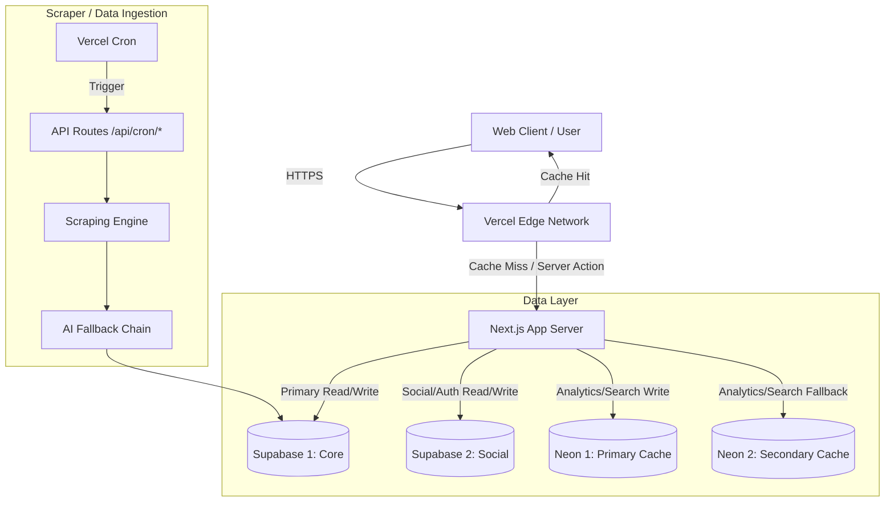

# Architecture Overview

SiliconPath is built using a modern, serverless architecture centered around the **Next.js App Router** (v14), with edge caching, multiple specialized databases, and a multi-provider AI fallback chain.

## 1. High-Level Architecture

## 2. The 4-Database Strategy

To ensure maximum resilience and clean separation of concerns, SiliconPath uses 4 distinct databases:

| Database | Provider | Purpose | Status |
|---|---|---|---|
| **DB1** | Supabase | **Core Data**: Opportunities, Organizations, News, Resources. | Active |
| **DB2** | Supabase | **Social Data**: Users, Connections, Messages, Feed. | Active (UI Dormant) |
| **DB3** | Neon (Serverless Postgres) | **Analytics & Fast Search**: Click tracking, search caching. | Active |
| **DB4** | Neon (Serverless Postgres) | **Failover**: Backup for analytics and search. | Active |

By separating the core, login-free aggregator (DB1) from the heavily-relational social graph (DB2), we achieve maximum performance for unauthenticated visitors. 

## 3. AI Fallback Chain

For parsing unstructured job descriptions (e.g., from DRDO or ISRO PDFs/websites), SiliconPath relies on a resilient AI fallback chain. If one provider fails (due to rate limits, downtime, or key rotation), the system instantly falls back to the next.

Current active chain:
1. **AWS Bedrock**
2. **Nvidia NIM**
3. **Cloudflare Workers AI**

*(Note: Groq, Gemini, and OpenRouter implementations exist in the codebase but are currently inactive or awaiting key rotation).*

## 4. Frontend Architecture

- **Next.js App Router**: Utilizes React Server Components (RSC) to fetch data directly from the databases during render, drastically reducing client-side bundle size.
- **Server Actions**: Form submissions (like subscribing to newsletters or reporting an issue) use Server Actions instead of traditional API endpoints.
- **Tailwind CSS & Lucide**: Minimal CSS payload, utilizing utility classes and SVG icons.

## 5. Background Jobs (Cron)

Data freshness is maintained via Vercel Cron jobs. These jobs hit protected API routes (e.g., `/api/cron/scrape-global`) that:
1. Fetch remote RSS feeds or HTML pages.
2. Filter content based on VLSI/Semiconductor keywords.
3. Pass complex unstructured text through the AI chain for JSON extraction.
4. Insert normalized records into **DB1**.
