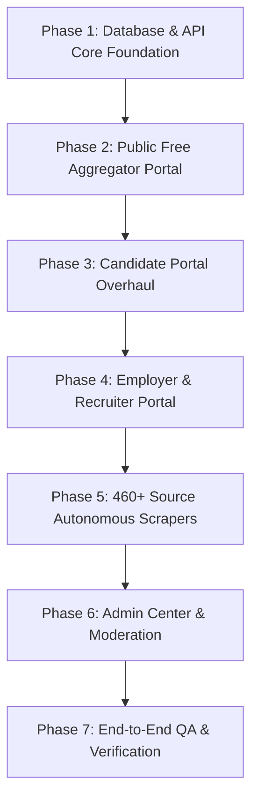

# Master Strategy & Implementation Plan — BerojgarDegreeWala (SiliconPath)

**Version:** 2026-08-17  
**Pattern:** Modular Monolith on Next.js 14 App Router + Supabase + Neon  
**Primary Goal:** Build a LinkedIn-style professional ecosystem dedicated to Semiconductors, VLSI, Electronics & Hardware in India with 3 distinct user portals + 1 Super Admin Portal.

---

## 1. Executive Summary & Core Platform Vision

BerojgarDegreeWala is engineered around **3 distinct user portals** in a unified, high-performance web platform, backed by an autonomous scraper engine and an admin command center:

```
                               ┌─────────────────────────────────────────────────────────────┐
                               │             BerojgarDegreeWala Web Platform                 │
                               └──────┬──────────────────┬───────────────────┬───────────────┘
                                      │                  │                   │
               ┌──────────────────────┴──────┐    ┌──────┴───────────┐ ┌─────┴──────────────────┐
               │          PORTAL 1           │    │     PORTAL 2     │ │        PORTAL 3        │
               │   Public Free Aggregator    │    │ Candidate Portal │ │ Employer / Recruiter   │
               │  (Zero Login Required)      │    │ (Job Seekers/Eng)│ │ (Companies/Labs/Inst)  │
               └──────────────┬──────────────┘    └──────┬───────────┘ └─────┬──────────────────┘
                              │                          │                   │
                              ├─ 460+ Scraped Openings   ├─ Profile & ATS    ├─ Company Profile
                              │  (ISRO, DRDO, Semi MNCs) │  Resume Builder   ├─ Job Posting Engine
                              ├─ Free VLSI Academy       ├─ Saved Jobs &     ├─ Applicant ATS &
                              │  (7 Verified Tracks)     │  1-Click Tracker  │  Stage Management
                              ├─ Semiconductor News Feed ├─ Network & Connect├─ Direct Candidate
                              ├─ Org Directory (88+ Labs)├─ 1-to-1 Realtime  │  Outreach & Messages
                              └─ Research/Career Guides  │  Direct Messaging └─ Live Postings CRUD
                                                         └─ Community Feed
                                                                 │
                                                  ┌──────────────┴──────────────┐
                                                  │          PORTAL 4           │
                                                  │     Super Admin Center      │
                                                  │  (Scraper Queue, Mod, ATS)  │
                                                  └─────────────────────────────┘
```

---

## 2. Root Cause Analysis of Current Failures

Our live browser audit and codebase inspection identified the exact root causes of current issues:

| # | Feature / Area | Observed Failure | Exact Root Cause in Codebase |
|---|---|---|---|
| 1 | **Candidate Network & Connections** | Connection suggestions cannot be clicked; user 3 not shown; mock `sug-*` error. | `frontend/src/app/api/network/suggestions/route.ts` contained overly aggressive `isTestAccount()` filtering that discarded accounts with display names or keywords. `useNetwork.ts` fell back to unconnectable mock IDs (`sug-1`, `sug-2`). |
| 2 | **Direct Messaging** | Messages fail to send or update live; conversation threads fail on reload. | `frontend/src/app/messages/page.tsx` was querying DB directly via anon Supabase client without session sync, while API routes used server credentials. Lack of real-time Postgres event listeners or polling fallback caused stale threads. |
| 3 | **Resume Builder** | Data filled in Resume Builder disappears upon page reload. | Form state in `frontend/src/app/resume/` was kept purely in React component local state (`useState`) without persisting updates to `user_profiles.resume_data` in Supabase upon saving. |
| 4 | **Saved / Bookmarked Jobs** | Bookmark toggle does not show jobs in `/saved` tab and resets on page reload. | Client-side bookmark handler failed to commit rows to `saved_opportunities` table due to client-side RLS policy mismatch and lack of optimistic query cache invalidation in React Query. |
| 5 | **Search & Category Filters** | Searching "Qualcomm" or "VLSI Verification" returns 0 results despite matching jobs on screen. | `frontend/src/app/api/opportunities/route.ts` (`isDisplayableOpportunity`) hardcoded a blacklist that excluded real keyword strings like "qualcomm vlsi lab", "lead risc-v", "senior asic verification engineer" thinking they were test fixtures. |
| 6 | **Scraper Pipeline** | Real career scrapers are idle; database has stale rows without deep metadata. | `vercel.json` cron was routed to `/api/scrapers/run-all` which is a placeholder. Real scraper pipeline `scrapeAllOpportunities` in `run-opportunity-scrape.ts` requires direct cron hookup and source batching. |
| 7 | **Academy Curriculum** | Track 6 is missing; progress is lost; content not wired to trusted sources. | `frontend/src/lib/academy/queries.ts` skipped Track 6 (Analog/Mixed-Signal IC Design) and did not fully embed resources from `trusted_sources_v3.json`. |
| 8 | **Footer Security Leak** | Admin login (`/admin`) link is publicly exposed in footer. | `frontend/src/components/Footer.tsx` statically rendered an `<a href="/admin">Admin Login</a>` link in public view. |

---

## 3. Master Execution Roadmap (Phase-by-Phase for OpenCode)

Each phase is self-contained, tested, and can be executed sequentially.



---

### Phase 1: Database & API Foundation Hardening

**Goal:** Ensure all tables in Supabase DB1 (`aqauempuwmbizqoaolop`) are correctly defined with proper constraints, foreign keys, and RLS policies.

#### Tasks:
1. **Consolidate Table Schemas in DB1:**
   - `user_profiles`: `id (uuid, PK)`, `email`, `username`, `display_name`, `headline`, `bio`, `avatar_url`, `skills (text[])`, `current_company`, `location`, `resume_data (jsonb)`, `account_type (candidate|employer|admin)`, `is_profile_public (bool)`.
   - `opportunities`: `id (uuid, PK)`, `title`, `slug`, `organization_id (FK)`, `category (jrf|srf|phd|job|internship|fellowship|govt-job)`, `location`, `salary_range`, `stipend`, `eligibility`, `deadline (date)`, `description`, `apply_url`, `source_url`, `source_type (scraped|employer_posted)`, `verification_status (verified|unverified|expired)`, `is_active (bool)`, `tags (text[])`.
   - `organizations`: `id (uuid, PK)`, `name`, `slug`, `logo_url`, `website`, `category (idm|fabless|psu|gov_lab|university|osat|eda)`, `location`, `is_verified (bool)`.
   - `connections`: `id (uuid, PK)`, `requester_id (FK)`, `addressee_id (FK)`, `status (pending|accepted|rejected)`, `created_at`, `updated_at`.
   - `conversations`: `id (uuid, PK)`, `participant_a (FK)`, `participant_b (FK)`, `last_message_at`, `created_at`.
   - `messages`: `id (uuid, PK)`, `conversation_id (FK)`, `sender_id (FK)`, `body (text)`, `is_read (bool)`, `created_at`.
   - `saved_opportunities`: `id (uuid, PK)`, `user_id (FK)`, `opportunity_id (FK)`, `created_at`.
   - `applications`: `id (uuid, PK)`, `user_id (FK)`, `opportunity_id (FK)`, `status (applied|reviewing|shortlisted|interview|rejected|offered)`, `resume_snapshot (jsonb)`, `cover_note`, `applied_at`.
   - `feed_posts`: `id (uuid, PK)`, `user_id (FK)`, `content (text)`, `media_urls (text[])`, `likes_count (int)`, `comments_count (int)`, `created_at`.
   - `learning_progress`: `id (uuid, PK)`, `user_id (FK)`, `track_slug`, `day_id`, `completed (bool)`, `updated_at`.

2. **Clean up DB Access Router:**
   - Update `frontend/src/lib/db/index.ts` and `frontend/src/lib/supabase.ts` to ensure all API routes use authenticated server client and server admin client consistently with zero session dropping.

---

### Phase 2: Public / Free Aggregator Portal (Zero Login Barrier)

**Goal:** Ensure anyone opening `https://berojgardegreewala.vercel.app` gets instant, high-speed access to verified opportunities, news, guides, organization directory, and the VLSI Academy without requiring any authentication.

#### Tasks:
1. **Fix Opportunity Search & Multi-Facet Filters (`/opportunities`):**
   - Remove destructive hardcoded title/org blacklists from `frontend/src/app/api/opportunities/route.ts`.
   - Fix keyword search in `frontend/src/lib/opportunities-query.ts` to search across `title`, `description`, `eligibility`, `tags`, and joined `organizations.name`.
   - Enable proper pagination and "Load More" to seamlessly browse through all 3,200+ opportunities.
   - Fix category tabs (`JRF`, `SRF`, `PhD`, `Full-time / Job`, `Internship`, `Govt PSU`) so clicking a tab strictly filters the list.

2. **Fix Opportunity Detail Page & Apply Links (`/opportunities/[slug]`):**
   - Ensure the detail page renders Organization, Category, Eligibility, Location, Salary/Stipend, and Application Deadline.
   - Fix the **"Apply on Official Website"** button so it opens the verified external career URL (`apply_url` or `source_url`) in a new tab with `target="_blank" rel="noopener noreferrer"`.
   - If user is logged in as Candidate, provide an option for 1-Click direct apply or tracking.

3. **Complete the Free VLSI Academy (`/academy`):**
   - Restore all **7 Structured Curriculum Tracks** based on `trusted_sources_v3.json`:
     * **Track 1:** Digital Design & RTL Fundamentals (Verilog, FSM, Combinational/Sequential logic, HDLBits, NPTEL IIT Kharagpur).
     * **Track 2:** SystemVerilog & UVM Verification (OOP, Constrained Random, Assertions, Functional Coverage, Doulos, Siemens Verification Academy).
     * **Track 3:** Physical Design & Backend Flow (RTL-to-GDSII, Synthesis, Floorplanning, CTS, Routing, STA, IIIT Delhi, OpenLane/OpenROAD).
     * **Track 4:** Computer Architecture & RISC-V SoC Design (ISA, Datapath, Pipelining, Caches, AMBA AXI/AHB).
     * **Track 5:** Open-Source ASIC & Silicon Fabrication (SkyWater 130nm / IHP 130nm PDKs, Magic VLSI, Netgen LVS, DRC).
     * **Track 6:** Analog & Mixed-Signal IC Design (CMOS Inverters, Op-Amps, Bandgap References, SPICE simulation).
     * **Track 7:** VLSI Interview Preparation & Core Assessment (Digital electronics puzzles, Verilog coding challenges, STA timing closure interview questions).
   - Embed free in-browser tools: EDA Playground, ChipVerify Lab, Icarus Verilog + GTKWave, Verilator, Surfer Waveform Viewer.
   - Allow free public browsing of all tracks without login; store checkpoint completion in localStorage for guests and sync to `learning_progress` on login.

4. **News Aggregator & Resource Guides (`/news`, `/resources`, `/organizations`):**
   - Fix search filter on `/news` to filter live semiconductor articles by keyword (e.g. ISRO, TSMC, Tata Electronics).
   - Verify all 5 comprehensive career guides on `/resources` (JRF/SRF Guide, PhD Roadmap, GATE Preparation, Semiconductor Career Pathways).
   - Ensure Organization Directory (`/organizations`) displays verified tags, location, active openings count, and links to filtered opportunities without breaking.

5. **Header & Footer Cleanup:**
   - Public Header shows: `Opportunities`, `Academy`, `News & Feed`, `Organizations`, `Resources`, `About`, `Contact`, `Sign In / Join`.
   - Public Footer: Remove exposed `/admin` link; replace with clean links to Platform Services, Categories, Guides, and Developer API.

---

### Phase 3: Candidate Portal Overhaul (LinkedIn-Style Experience)

**Goal:** Provide candidates with a rich professional profile, ATS-friendly resume builder, bookmarking, application tracking, connection requests, and real-time 1-to-1 messaging.

#### Tasks:
1. **Candidate Profile (`/profile`):**
   - Support viewing & editing Full Name, Headline, Bio, Location, Current Company/Institute, Skills, and Social Links.
   - Save updates directly to `user_profiles` table in Supabase DB1 and ensure changes persist on reload.

2. **ATS Resume Builder (`/resume`):**
   - Multi-step builder: Personal Info, Professional Summary, Work Experience, Education, Projects & Publications, Technical Skills (Verilog, UVM, STA, OpenROAD, Python, C++).
   - Live interactive ATS-optimized resume preview.
   - Persist resume JSON state to `user_profiles.resume_data` upon clicking "Save Resume".
   - Export to PDF using client-side print stylesheet / PDF renderer.

3. **Saved Opportunities & 1-Click Application Tracking (`/saved`, `/applications`):**
   - Clicking bookmark icon on any opportunity saves it to `saved_opportunities` with instant visual toggle.
   - `/saved` page displays all bookmarked opportunities with 1-click unsave and direct apply buttons.
   - When a candidate applies to an opportunity, automatically log the submission in `applications` table.
   - `/applications` page displays status badges: `Applied`, `Under Review`, `Shortlisted`, `Interview Scheduled`, `Rejected`, `Offered`.

4. **Candidate Network & Connections (`/network`):**
   - Fix candidate discovery in `/api/network/suggestions`: rank suggestions by mutual skills, institute, and location.
   - Remove test account filters that block legitimate user searches.
   - Two-way connection flow:
     * User A clicks "Connect" on User B's card -> Creates `pending` record in `connections` table.
     * User B receives notification & sees request in "Pending Requests" tab.
     * User B clicks "Accept" -> Updates status to `accepted`.
     * Both User A and User B see each other in "My Connections" tab with direct "Message" button.

5. **1-to-1 Direct Messaging System (`/messages`):**
   - Clean split-pane interface: Left panel shows active conversations with avatar, name, last message snippet, timestamp, and unread badge. Right panel shows active chat thread.
   - When clicking "Message" on any connected profile, open/create conversation thread via `/api/messages`.
   - Real-time message synchronization via Supabase Realtime channel (`postgres_changes` on `messages` table) with robust 3-second polling fallback.
   - Support message input, Enter key to send, timestamp rendering, sender vs receiver message bubbles, and automatic "mark as read" upon opening conversation.

6. **Community Feed / Discussion (`/feed`):**
   - Allow logged-in candidates to create posts, ask technical VLSI questions, share project updates or paper summaries.
   - Render author avatar, name, headline, post text, like counter with toggle, and comment thread.

---

### Phase 4: Employer & Recruiter Portal

**Goal:** Dedicated portal for Semiconductor Companies, Foundries, Design Startups, and University Labs to post openings, review applicants, and manage recruitment.

#### Tasks:
1. **Employer Profile (`/employer/profile`):**
   - Company Name, Tagline, Industry Category (Fabless, Foundry, OSAT, EDA, Research Lab, University), Headquarters, Website URL, Company Description, Logo.
   - Save directly to `organizations` and `user_profiles` (with role `employer`).

2. **Job Posting Engine (`/post-job` or `/employer/post`):**
   - Comprehensive posting form:
     * Job Title (e.g. *Physical Design Engineer - 5nm STA*)
     * Organization Name (autofilled from company profile)
     * Category (`Job`, `Internship`, `JRF`, `SRF`, `PhD Fellowship`, `Trainee`)
     * Work Location (`Bengaluru`, `Hyderabad`, `Noida`, `Pune`, `Chennai`, `Remote`, etc.)
     * Experience Level (`Entry Level / Fresher`, `1-3 Years`, `3-5 Years`, `5+ Years`)
     * Salary / Stipend Range (e.g. `₹12,00,000 - ₹20,00,000 / yr` or `₹37,000/mo + HRA`)
     * Eligibility / Qualifications (`B.Tech/M.Tech in ECE/VLSI/EE`)
     * Application Deadline (Date picker)
     * Detailed Job Description (Markdown / rich text)
     * Apply Mode (`Direct on Platform` or `External Official URL`)
   - On submission, insert opportunity into `opportunities` table with `source_type: 'employer_posted'`, `verification_status: 'verified'`, `is_active: true`.
   - Instant reflection in "My Postings" and public `/opportunities` feed.

3. **Applicant Tracking System (ATS) (`/employer/applicants`):**
   - Filter applicants by posted job.
   - View candidate profile, headline, skills, resume snapshot, and cover note.
   - Action buttons per applicant: `Shortlist`, `Move to Interview`, `Reject`, `Extend Offer`.
   - Status changes instantly update candidate's `/applications` dashboard.
   - "Message Candidate" button to open direct recruiter-candidate chat thread.

4. **"My Postings" Management (`/employer/dashboard`):**
   - List all company job postings with active applicant count, view count, posting date, and status toggle (Active / Paused / Closed).
   - Edit job posting details or delete/archive posting.

---

### Phase 5: Autonomous Career Scraper Pipeline (460+ Sources)

**Goal:** Build and activate the automated scraping engine to scrape, verify, and index job openings from all 460+ sources in `berojgardegreewala-expanded-global-source-list-v4.md`.

#### Source Categories to Integrate:
1. **Indian Defense & Government Research Labs:**
   - DRDO (LRDE, DEAL, RCI, SAG, CAIR), ISRO, Antrix, CSIR (CEERI, NPL, CSIO), BARC, C-DOT, SCL Chandigarh, C-MET, VSSC, SAC, BEL, HAL, ECIL, ITI Limited.
2. **Indian Premier Universities & Research Institutes:**
   - 23 IITs, IISc Bangalore, 31 NITs, 25 IIITs, IIST Trivandrum, DIAT Pune, BITS Pilani, TIFR, DA-IICT.
3. **Global Semiconductor Manufacturers & IDMs:**
   - Intel, TSMC, Samsung Semiconductor, Micron, Texas Instruments, Infineon, STMicroelectronics, NXP, onsemi, Renesas, GlobalFoundries, Tower Semiconductor, Wolfspeed.
4. **Fabless & Chip Design Leaders:**
   - NVIDIA, AMD, Qualcomm, Broadcom, MediaTek, Marvell, Apple Silicon, ARM, Cirrus Logic, Synaptics, Lattice, SiFive, Tenstorrent, Groq, Cerebras.
5. **EDA & Design Tools:**
   - Synopsys, Cadence Design Systems, Siemens EDA, Ansys, Keysight.
6. **OSAT & Packaging:**
   - Amkor, ASE Group, JCET, Powertech, Deca Technologies, Tata Electronics OSAT.
7. **Quantum Hardware, Photonics & Sensors:**
   - IonQ, Rigetti, PsiQuantum, IBM Quantum, Coherent, Lumentum, TDK, Honeywell Sensing.

#### Scraper Engine Architecture:
- **Batching & Rate-Limiting:** Execute scrapers in batches of 20-30 sources per run to avoid IP blocking and serverless timeouts.
- **ATS Adapters:** Standardized parsers for Greenhouse (`boards-api.greenhouse.io`), Lever (`api.lever.co`), Workday (`myworkdayjobs.com`), SmartRecruiters, and custom HTML/RSS parsers.
- **Normalization & Deduplication:** Hash `source_url` and `title + org + location` to prevent duplicate insertions.
- **Automated Link & Expiry Verification:** Link checker cron validates active HTTP 200 status; expired deadlines automatically marked `is_active: false`.
- **Vercel Cron Trigger:** Route daily cron in `vercel.json` with `CRON_SECRET` to `/api/cron/scrape-opportunities`.

---

### Phase 6: Super Admin Command Center & Moderation

**Goal:** Secure admin interface for moderation, scraper orchestration, and platform control.

#### Tasks:
1. **Secure Admin Authentication (`/admin/login`):**
   - Protected with HMAC session token and secure password verification.
   - Gated at middleware level; unauthorized requests redirected to `/login`.

2. **Scraper Orchestration Dashboard (`/admin/scrapers`):**
   - View all 460+ configured sources with last scrape time, success rate, and active jobs count.
   - "Trigger Scraper Run" button for instant manual execution of any source batch.
   - Scrape logs viewer with error diagnostics.

3. **Opportunity Verification Queue (`/admin/opportunities`):**
   - Review pending scraped opportunities, approve/verify with 1 click, edit details, or reject spam.

4. **Platform Moderation & Metrics (`/admin/analytics`):**
   - Total active opportunities, daily user signups, applications sent, popular search keywords, and track completion statistics.

---

### Phase 7: Quality Verification, Testing & Polish

**Goal:** Full verification across all devices and roles.

#### Quality Gates:
- [ ] **Public Portal:** Clean homepage load, working search across keywords, verified apply links open official career portals, Academy all 7 tracks functional.
- [ ] **Candidate Portal:** Profile persists, Resume Builder persists, Bookmarking persists, Connection request/accept flow verified between two users, 1-to-1 messaging verified with two-way message exchange.
- [ ] **Employer Portal:** Employer posts a job -> Appears instantly in public search -> Candidate applies -> Employer sees application in ATS -> Employer shortlists candidate.
- [ ] **Mobile Responsiveness:** 100% responsive on 375px, 390px, 768px, and 1440px viewports with working drawer menu.
- [ ] **Security & Console Cleanliness:** Zero exposed admin links in footer; 0 console errors on all core routes.

---

## 4. OpenCode Execution Protocol

When OpenCode works through this plan, follow this exact rule for every single phase:
1. **Pick one Phase at a time** (e.g., Phase 1 -> Phase 2 -> Phase 3 -> Phase 4 -> Phase 5 -> Phase 6 -> Phase 7).
2. **Implement the exact code fixes** for that phase in fewest, highest-quality files.
3. **Execute a runnable check** (automated test or browser verification) to prove the feature works.
4. **Update `project-bible/CHANGELOG.md`** with exact files changed.
5. **Prompt user for "continue"** to move to the next phase smoothly.
