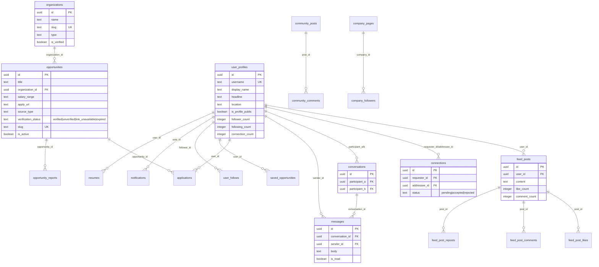
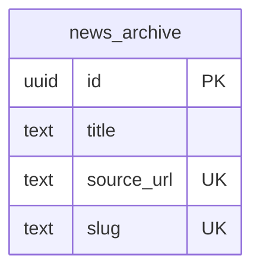
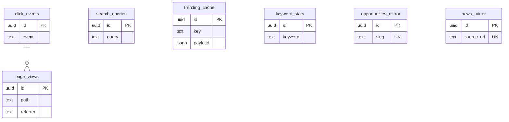
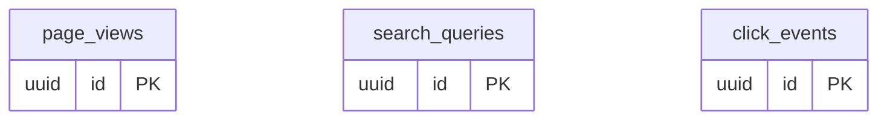

# Entity-Relationship Diagram

Simple ER summary of live tables (verified 2026-08-19). Cross-database FKs are not possible; references are enforced at the application layer.

## DB1 — Supabase Project 1 (production core)

## DB2 — Supabase Project 2 (legacy mirror)

`user_profiles` also mirrored here via `syncProfile` (`frontend/src/lib/db/index.ts`).

## Neon 1 — analytics + mirrors

## Neon 2 — cache mirror

Neon 2 holds a subset (cache mirror) of Neon 1's `page_views` / `search_queries` / `click_events`. Mirrors are written by `/api/sync-replica`.
