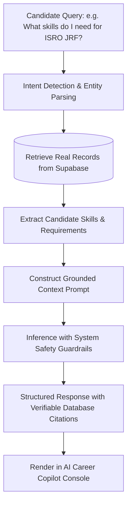

# AI Career Copilot Architecture

**Platform**: BerojgarDegreeWala  
**Document Version**: 1.0 (Phase 30C Grounded Intelligence Model)  
**Author**: Antigravity AI & Career Intelligence Team  

---

## 1. Grounded Intelligence Mandate

Traditional chatbots hallucinate fictional job openings or invent requirements. BerojgarDegreeWala's AI Career Copilot adheres strictly to the **Grounded Database Truth Mandate**:
- All recommendations, eligibility explanations, and career pathways must reference live PostgreSQL records in `opportunities`, `user_profiles`, and `news_articles`.
- No synthetic opportunities may be output to users.

---

## 2. Retrieval-Augmented Query Pipeline

---

## 3. Privacy & Cross-User Isolation

1. **User Scope Isolation**: AI endpoints (`/api/ai/*`) only access the authenticated user's resume, applications, and saved jobs (`WHERE user_id = auth.uid()`).
2. **Zero Sensitive Leakage**: Admin settings, service role keys, and private employer notes are strictly excluded from AI prompts.
