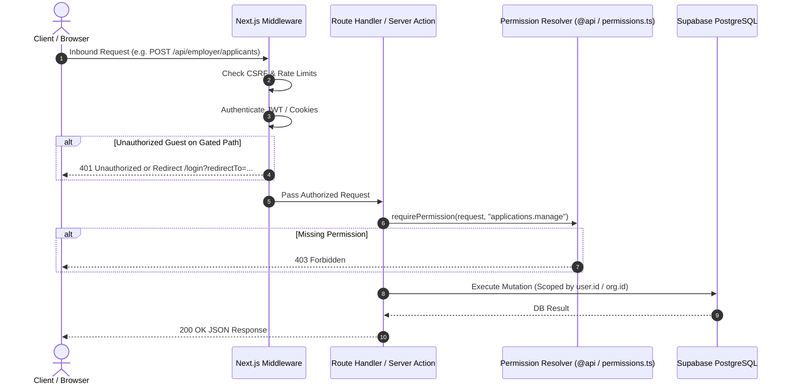

# Authorization Flow & Enforcement Architecture

**Platform**: BerojgarDegreeWala  
**Document Version**: 2.0 (Phase 30B Authorization Lifecycle)  

---

## 1. Request Authorization Lifecycle

Every inbound request flows through layered authorization gates before executing database mutations:



---

## 2. Server-Side Route Guard Pattern

Route handlers use standard helpers from `@berojgardegreewala/api` and `frontend/src/lib/permissions.ts`:

```typescript
import { NextRequest, NextResponse } from "next/server";
import { requirePermission } from "@/lib/permissions";
import { supabaseAdmin } from "@/lib/supabase";

export async function POST(request: NextRequest) {
  const { authorized, user, status } = await requirePermission(request, "opportunities.create");
  if (!authorized || !user) {
    return NextResponse.json({ error: "Forbidden" }, { status });
  }

  // Authorized employer / manager mutation logic here
  return NextResponse.json({ success: true });
}
```

---

## 3. Defense-in-Depth Rules

1. **Never Trust Client State**: UI visibility flags (e.g. `isEmployer`, `canPost`) are solely for user interface rendering. Every API endpoint enforces authorization server-side.
2. **Timing-Safe Admin Checks**: Admin secret validations use `timingSafeEqual()` to eliminate side-channel timing vulnerabilities.
3. **Fail-Closed Strategy**: If credentials or permissions are ambiguous, the system defaults to 401 Unauthorized or 403 Forbidden.
