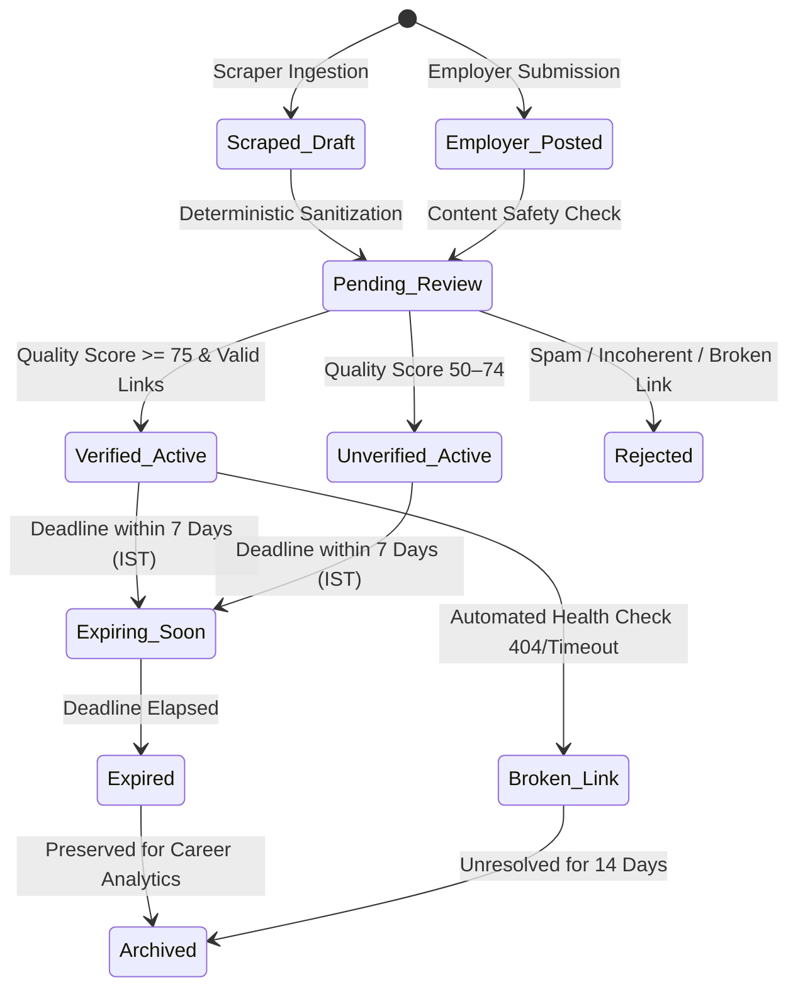

# Opportunity Lifecycle & Verification Architecture

**Platform**: BerojgarDegreeWala  
**Document Version**: 1.0 (Phase 30C Opportunity Data Pipeline)  

---

## 1. State Machine & Transition Diagram

---

## 2. Ingestion & Quality Gates

1. **Gate 1: URL & Host Normalization**: Strips UTM tracking params, cleans whitespace, validates host against blacklists.
2. **Gate 2: Title De-noising**: Removes boilerplate phrases (`"CLICK HERE TO APPLY"`, `"ADVT NO 2026/04"` prefixes).
3. **Gate 3: Duplicate Fingerprinting**: Calculates hash on `(normalized_source_url, organization_name, cleaned_title)` to prevent duplicate listings.
4. **Gate 4: Quality Scoring**: Computes deterministic 0–100 score before publishing.
