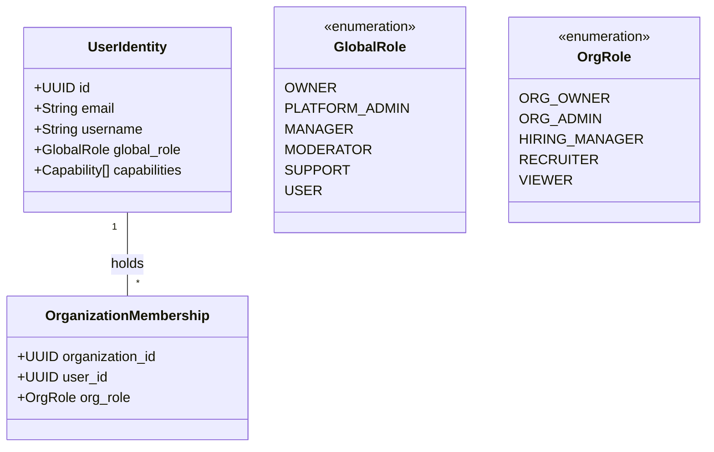

# Phase 30: Identity, Role Architecture & Portal Unification Audit

**Platform**: BerojgarDegreeWala  
**Audit Date**: August 28, 2026  
**Auditor**: Antigravity Pair-Programming Agent & RBAC Security Specialist  
**Design Mandate**: Unified Platform Access (Not 3 Disjoint Apps)  
**Status**: **AUDIT COMPLETE & SPECIFIED**

---

## 1. Executive Summary & Problem Diagnosis

Before Phase 30, the platform treated Candidate and Employer roles as mutually exclusive personas:
1. **Siloed Navigation**: When an account had `role = "employer"`, `Navbar.tsx` replaced the global navigation entirely with employer-only links (Dashboard, Jobs, Applicants, Talent, Messages), stripping away access to the Opportunities feed, News, Academy, and Personal Profile.
2. **Binary Role Field**: User authorization relied primarily on a single string column `user_profiles.account_type` or `user_metadata.role`, lacking a scalable permission model (`hasPermission()`) for Platform Managers and Organization Team Members.
3. **Hardcoded Authorization Checks**: Route handlers contained ad-hoc role comparisons rather than centralized, permission-based capability checks.

### Phase 30 Unification Solution:
- **Single Unified Identity**: Every user account is an individual authenticated identity who can progressively acquire candidate, employer, and organizational capabilities.
- **Additive Capabilities**: An Employer retains full access to browse opportunities, save jobs, engage in the community feed, and utilize learning academy tracks.
- **Granular RBAC**: Strict separation between **Global Platform Roles** (`OWNER`, `PLATFORM_ADMIN`, `MANAGER`, `MODERATOR`, `SUPPORT`, `USER`) and **Organization Roles** (`ORG_OWNER`, `ORG_ADMIN`, `HIRING_MANAGER`, `RECRUITER`, `VIEWER`).

---

## 2. Global vs. Organization Role Taxonomy

### Global Platform Roles:
- **`OWNER`**: Sovereign authority. Controls platform configuration, admin appointments, and system secrets. Non-demotable.
- **`PLATFORM_ADMIN`**: Global management across users, opportunities, organizations, scrapers, and telemetry.
- **`MANAGER`**: Permission-scoped operations (e.g. opportunity verification, scraper monitoring, content moderation).
- **`MODERATOR`**: Community content moderation and report handling.
- **`SUPPORT`**: Customer inquiries, feedback, and user support ticket management.
- **`USER`**: Standard base authenticated identity.

### Organization Team Roles:
- **`ORG_OWNER`**: Organization creator / verified owner. Manages company profile, team seats, billing, and job postings.
- **`ORG_ADMIN`**: Full administrative rights over organization jobs, applicants, and team member permissions.
- **`HIRING_MANAGER`**: Can create/edit job postings and review/advance applicants in the ATS pipeline.
- **`RECRUITER`**: Can search talent pool, message candidates, and manage assigned applicant stages.
- **`VIEWER`**: Read-only access to organization jobs and applicant counts.

---

## 3. Reusable Permission Taxonomy

Instead of checking `if (user.role === 'admin')`, the platform now evaluates granular permissions:

| Permission Key | Description | Default Granted Roles |
| :--- | :--- | :--- |
| `opportunities.read` | View public active opportunities | Public, All Roles |
| `opportunities.apply` | Submit job applications | Candidate, Employer, All Auth |
| `opportunities.bookmark` | Save/bookmark opportunities | Candidate, Employer, All Auth |
| `opportunities.create` | Post new job listings | Employer, Org Roles, Admin, Owner |
| `opportunities.verify` | Approve scraped/pending opportunities | Manager (if assigned), Admin, Owner |
| `opportunities.delete` | Hard/soft delete opportunities | Admin, Owner |
| `users.read` | View user profile metadata | Public (Public fields), Auth |
| `users.manage` | Suspend/update user status | Admin, Owner |
| `organizations.manage` | Update company profile & settings | Org Owner, Org Admin, Admin, Owner |
| `organizations.verify` | Grant verified badge to organizations | Admin, Owner |
| `scrapers.read` | View scraper health & run logs | Manager (if assigned), Admin, Owner |
| `scrapers.run` | Trigger scraper runs | Manager (if assigned), Admin, Owner |
| `analytics.read` | Access platform metrics & click telemetry | Admin, Owner |
| `system.settings` | Modify platform secrets & owner settings | **OWNER ONLY** |

---

## 4. Owner Security & Sovereign Protection

1. **Non-Demotable Owner**: The Owner identity is hard-anchored to `ADMIN_USERNAME` / Sovereign ID. No API endpoint or database trigger can demote the owner or strip owner permissions.
2. **Zero Self-Escalation**: Platform Admins and Managers cannot escalate their own global role or assign the `OWNER` role to any account.
3. **Audit Trail**: Every administrative role change generates an immutable record in `audit_logs`.
