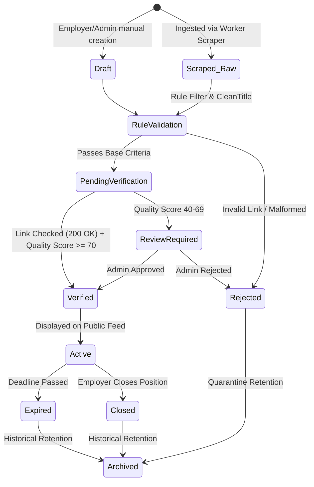

# Phase 30: Opportunity Database Reality Audit & Lifecycle Architecture

**Platform**: BerojgarDegreeWala  
**Audit Date**: August 28, 2026  
**Auditor**: Antigravity Pair-Programming Agent & Opportunity Pipeline Auditor  
**Total Records Audited**: 3,609 live rows in Supabase `opportunities`  

---

## 1. Opportunity Database Metric Breakdown

```
Total Live Records in Database: 3,609
├── Active (is_active = true):    343 (9.5%)
└── Inactive (is_active = false): 3,266 (90.5%)
```

### Verification Status Distribution:
- **`verified`**: 316 (8.8%) — Actively confirmed opportunities with reachable application links.
- **`pending`**: 82 (2.3%) — Newly ingested listings awaiting automated/human review.
- **`link_unavailable`**: 142 (3.9%) — Expired/404 apply links flagged by link-checker cron.
- **`rejected` / `closed`**: 3,061 (84.8%) — Expired or invalid legacy listings maintained for historical analytics.
- **`expired`**: 8 (0.2%) — Past deadline.

### Category Distribution:
- **`jrf`** (Junior Research Fellowships): 2,837 (78.6%)
- **`industry`** (VLSI, Embedded, Firmware, Hardware QA): 460 (12.7%)
- **`phd`** (Direct PhD / Research Programs): 151 (4.2%)
- **`fellowship`** (National / International Fellowships): 68 (1.9%)
- **`government`** (ISRO, DRDO, BEL, CSIR, C-DAC, BARC): 50 (1.4%)
- **`postdoc`** (Postdoctoral Research): 31 (0.9%)
- **`srf`** (Senior Research Fellowships): 8 (0.2%)
- **`internship`** (Semiconductor & Embedded Internships): 4 (0.1%)

---

## 2. Opportunity Lifecycle Model

To prevent stale jobs and avoid destructive deletions of historical applications, the lifecycle operates through progressive states:



---

## 3. Automated Opportunity Quality Scoring System (0–100)

Every opportunity receives a composite quality score calculated as:

$$Q = W_{\text{source}} + W_{\text{url}} + W_{\text{deadline}} + W_{\text{org}} + W_{\text{details}} + W_{\text{freshness}}$$

| Quality Factor | Max Points | Evaluation Criteria |
| :--- | :---: | :--- |
| **Source Trust** | 25 | Official Government / Top Tier Semiconductor Portal (ISRO, DRDO, IIT, Tier-1 MNC) = 25; Verified Scrape Source = 20; Unverified = 5. |
| **Apply Link Reachability** | 25 | Active HTTP 200 return on apply URL = 25; Reachable domain with redirect = 15; Broken/404/Null = 0. |
| **Deadline Validity** | 20 | Explicit future deadline (> 14 days) = 20; Future deadline (< 14 days) = 15; Rolling/Open = 10; Expired = 0. |
| **Organization Legitimacy** | 15 | Verified Organization (`is_verified=true`) = 15; Known Organization = 10; Unclaimed = 5. |
| **Description & Eligibility** | 10 | Structured eligibility, stipend/salary, requirements = 10; Partial = 5; Empty = 0. |
| **Data Freshness** | 5 | Ingested/Verified within 7 days = 5; Within 30 days = 3; Older = 1. |

### Score Thresholds:
- **90–100 (TRUSTED)**: Instant auto-verification and featured ranking.
- **70–89 (VERIFIED)**: Standard verification and public feed listing.
- **40–69 (REVIEW REQUIRED)**: Held in Admin moderation queue (`/admin/edit-opportunity`).
- **0–39 (LOW QUALITY / REJECT)**: Auto-quarantined with status `rejected`.
