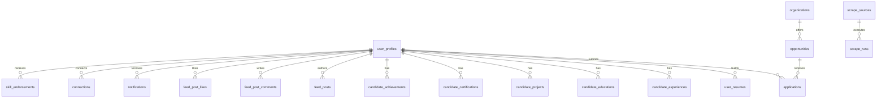

# Phase 30: Platform Architecture Discovery Audit

**Platform**: BerojgarDegreeWala  
**Audit Date**: August 28, 2026  
**Auditor**: Antigravity Pair-Programming Agent & System Architecture Auditor  
**Target Environment**: Production (`https://berojgardegreewala.vercel.app`) & Local Staging (`http://localhost:3000`)  
**Backend Infrastructure**: Supabase PostgreSQL (`aqauempuwmbizqoaolop`), Neon Serverless Postgres, Next.js 14 App Router  
**Audit Status**: **DISCOVERY COMPLETE — REALITY MAPPED (NO DESTRUCTIVE CHANGES PERFORMED)**

---

## 1. Executive Summary & Architectural Reality

BerojgarDegreeWala is a unified AI-powered semiconductor and electronics engineering career platform.
Our discovery audit examined every frontend route (82 pages), backend API route (171 endpoints), live database entity (21 active Supabase tables, 7 Neon tables), and authentication/authorization gate.

### Key Discovery Findings:
1. **Unified Platform, Not 3 Disjoint Apps**:
   - The platform serves **Guest**, **Candidate**, **Employer**, **Manager**, **Admin**, and **Owner** users through a unified Next.js 14 App Router codebase.
   - Core discovery, news, academy, and search are fully accessible to guests without login.
   - Candidates and Employers share the global design system, social feed, professional network, and messaging infrastructure, with progressive capability layering.
2. **Database Truth**:
   - Primary user table is `user_profiles` (27 columns, 5 active rows). Legacy concepts like `profiles` or `candidate_profiles` do not exist in live PostgreSQL.
   - Resume persistence is powered by `user_resumes` (14 columns, 2 active rows).
   - Direct messaging uses a 2-table model: `conversations` (4 rows) and `messages` (22 rows).
   - Opportunity repository holds 3,609 records (343 active, 316 verified, 82 pending review, 3,061 rejected/archived, 8 expired).
3. **Authentication & Authorization Architecture**:
   - User identity is managed via Supabase Auth (JWT bearer tokens and SSR cookies).
   - Route and API gating in `middleware.ts` enforces `GATED_PATHS` and `EMPLOYER_ONLY_PATHS`.
   - Admin routes (`/api/admin/*`) are safeguarded fail-closed by `requireAdmin()` with `ADMIN_PASSWORD` / HMAC token validation.

---

## 2. Frontend Route Inventory & Classification (82 Routes)

| Route | Classification | Gating Mechanism | Current Status | Description |
| :--- | :--- | :--- | :--- | :--- |
| `/` | **PUBLIC / CANDIDATE** | Open (Personalized if logged in) | ✅ Active | Hero discovery, trending opportunities, feed preview |
| `/opportunities` | **PUBLIC** | Open | ✅ Active | Opportunity feed, facet filters, search |
| `/opportunities/[slug]` | **PUBLIC** | Open | ✅ Active | Opportunity detail page, requirements, apply CTA |
| `/opportunities/location/[city]` | **PUBLIC** | Open | ✅ Active | City-specific opportunity listings |
| `/academy` | **PUBLIC** | Open | ✅ Active | Semiconductor learning academy tracks |
| `/academy/[track]` | **PUBLIC** | Open | ✅ Active | Curriculum modules, day-by-day learning |
| `/academy/[track]/day/[day]` | **PUBLIC / CANDIDATE** | Open (Progress saved if logged in) | ✅ Active | Interactive learning day content |
| `/academy/[track]/assessment` | **CANDIDATE** | Auth recommended | ✅ Active | Track certification assessments |
| `/news` | **PUBLIC** | Open | ✅ Active | Semiconductor & hardware industry news stream |
| `/news/[slug]` | **PUBLIC** | Open | ✅ Active | Detailed article view |
| `/ask-ai` | **PUBLIC / CANDIDATE** | Open (Rate-limited for guests) | ✅ Active | AI Semiconductor Career Assistant & Chat |
| `/chat` | **PUBLIC / CANDIDATE** | Open | ✅ Active | Interactive AI Chat interface |
| `/match` | **CANDIDATE** | Authenticated | ✅ Active | AI Job & Opportunity Matching engine |
| `/login` | **PUBLIC** | Open | ✅ Active | Candidate/Employer authentication |
| `/signup` | **PUBLIC** | Open | ✅ Active | Account registration with role selection |
| `/auth/signin` | **PUBLIC** | Redirects to `/login` | ✅ Active | Legacy route redirect |
| `/onboarding` | **AUTHENTICATED** | Auth Gated | ✅ Active | New user profile wizard |
| `/dashboard` | **CANDIDATE** | Auth Gated | ✅ Active | Candidate application & activity hub |
| `/profile` | **CANDIDATE** | Auth Gated (`/profile/me`) | ✅ Active | Authenticated profile editor & overview |
| `/profile/[username]` | **PUBLIC / CANDIDATE** | Open (Editable by owner) | ✅ Active | Public LinkedIn-style profile page |
| `/people` | **PUBLIC / CANDIDATE** | Open | ✅ Active | Talent & peer discovery |
| `/people/[username]` | **PUBLIC** | Open | ✅ Active | Direct public profile alias |
| `/feed` | **CANDIDATE / EMPLOYER** | Auth Gated | ✅ Active | Professional community feed & discussions |
| `/network` | **CANDIDATE / EMPLOYER** | Auth Gated | ✅ Active | Connection graph & recommendations |
| `/messages` | **CANDIDATE / EMPLOYER** | Auth Gated | ✅ Active | Real-time direct messaging threads |
| `/notifications` | **CANDIDATE / EMPLOYER** | Auth Gated | ✅ Active | Activity alerts and notifications |
| `/resume` | **CANDIDATE** | Auth Gated | ✅ Active | Resume Builder & ATS Score analyzer |
| `/saved` | **CANDIDATE** | Auth Gated | ✅ Active | Saved opportunities & bookmarks |
| `/applications` | **CANDIDATE** | Auth Gated | ✅ Active | Submitted application tracking pipeline |
| `/search` | **PUBLIC** | Open | ✅ Active | Global full-text search across all entities |
| `/community` | **PUBLIC / CANDIDATE** | Open | ✅ Active | Community discussions & forum |
| `/community/[id]` | **PUBLIC / CANDIDATE** | Open | ✅ Active | Community thread view & comments |
| `/companies` | **PUBLIC** | Open | ✅ Active | Semiconductor employers directory |
| `/companies/[slug]` | **PUBLIC** | Open | ✅ Active | Company overview, tech stack, open roles |
| `/organizations` | **PUBLIC** | Open | ✅ Active | Canonical organization directory |
| `/organizations/[slug]` | **PUBLIC** | Open | ✅ Active | Canonical organization detail |
| `/categories` | **PUBLIC** | Open | ✅ Active | Category taxonomy directory |
| `/category/[category]` | **PUBLIC** | Open | ✅ Active | Category-filtered opportunity feed |
| `/resources` | **PUBLIC** | Open | ✅ Active | Semiconductor career resource guides |
| `/resources/[slug]` | **PUBLIC** | Open | ✅ Active | Specific resource guide (e.g. JRF vs SRF) |
| `/contact` | **PUBLIC** | Open | ✅ Active | Support contact & inquiry form |
| `/about` | **PUBLIC** | Open | ✅ Active | About BerojgarDegreeWala mission |
| `/post-job` | **EMPLOYER** | Role Gated (`employer`) | ✅ Active | Quick job posting workflow |
| `/employer` | **EMPLOYER** | Role Gated (`employer`) | ✅ Active | Employer portal root |
| `/employer/dashboard` | **EMPLOYER** | Role Gated (`employer`) | ✅ Active | Employer metrics & hiring pipeline |
| `/employer/jobs` | **EMPLOYER** | Role Gated (`employer`) | ✅ Active | Job postings management |
| `/employer/jobs/[id]` | **EMPLOYER** | Role Gated (`employer`) | ✅ Active | Specific job detail & analytics |
| `/employer/jobs/[id]/edit` | **EMPLOYER** | Role Gated (`employer`) | ✅ Active | Edit job posting |
| `/employer/jobs/[id]/applicants` | **EMPLOYER** | Role Gated (`employer`) | ✅ Active | Job applicant pipeline |
| `/employer/applicants` | **EMPLOYER** | Role Gated (`employer`) | ✅ Active | Global ATS Applicant Tracking Kanban |
| `/employer/applicants/[id]` | **EMPLOYER** | Role Gated (`employer`) | ✅ Active | Candidate application review & notes |
| `/employer/talent` | **EMPLOYER** | Role Gated (`employer`) | ✅ Active | Candidate talent search & skill filter |
| `/employer/talent/[username]` | **EMPLOYER** | Role Gated (`employer`) | ✅ Active | Candidate review & direct reachout |
| `/employer/company` | **EMPLOYER** | Role Gated (`employer`) | ✅ Active | Company profile & tech stack editor |
| `/employer/company-claim` | **EMPLOYER** | Role Gated (`employer`) | ✅ Active | Claim unclaimed organization profile |
| `/employer/team` | **EMPLOYER** | Role Gated (`employer`) | ✅ Active | Team member management |
| `/employer/messages` | **EMPLOYER** | Role Gated (`employer`) | ✅ Active | Employer recruitment direct messages |
| `/employer/analytics` | **EMPLOYER** | Role Gated (`employer`) | ✅ Active | Hiring analytics & applicant metrics |
| `/employer/settings` | **EMPLOYER** | Role Gated (`employer`) | ✅ Active | Employer organization settings |
| `/employers` | **PUBLIC** | Open | ✅ Active | Employer marketing & landing page |
| `/admin` | **ADMIN / OWNER** | Password/HMAC Gated | ✅ Active | Admin command center dashboard |
| `/admin/analytics` | **ADMIN / OWNER** | Password/HMAC Gated | ✅ Active | Platform metrics, users, scrapers |
| `/admin/applications` | **ADMIN / OWNER** | Password/HMAC Gated | ✅ Active | Global applications overview |
| `/admin/add-opportunity` | **ADMIN / OWNER** | Password/HMAC Gated | ✅ Active | Manual opportunity creation |
| `/admin/edit-opportunity/[id]` | **ADMIN / OWNER** | Password/HMAC Gated | ✅ Active | Opportunity moderation & editing |
| `/admin/companies` | **ADMIN / OWNER** | Password/HMAC Gated | ✅ Active | Organization verification & claims |
| `/admin/talent-pool` | **ADMIN / OWNER** | Password/HMAC Gated | ✅ Active | Verified talent directory |
| `/admin/scrape-health` | **ADMIN / OWNER** | Password/HMAC Gated | ✅ Active | Scraper health & telemetry |
| `/admin/performance` | **ADMIN / OWNER** | Password/HMAC Gated | ✅ Active | System latency & database benchmarks |
| `/admin/announcements` | **ADMIN / OWNER** | Password/HMAC Gated | ✅ Active | Platform banner announcements |
| `/admin/add-news` | **ADMIN / OWNER** | Password/HMAC Gated | ✅ Active | Manual news posting |

---

## 3. Backend API Route Taxonomy (171 Endpoints)

| Subsystem | Endpoint Range | Primary Tables | Auth & Role Requirements | Active Status |
| :--- | :--- | :--- | :--- | :--- |
| **Opportunities Discovery** | `/api/opportunities/*`, `/api/categories`, `/api/similar/*` | `opportunities`, `organizations` | Public GET; Auth POST/PATCH | ✅ Active |
| **Applications & ATS** | `/api/applications/*`, `/api/employer/applicants/*` | `applications`, `opportunities` | Candidate Auth / Employer Auth | ✅ Active |
| **User & Profile Management** | `/api/profile/*`, `/api/profile/me/*`, `/api/people/*` | `user_profiles`, child section tables | Bearer JWT / Cookie Auth | ✅ Active |
| **Social & Feed** | `/api/feed/*`, `/api/feed/posts/*` | `feed_posts`, `feed_post_comments`, `feed_post_likes` | Authenticated (Candidate/Employer) | ✅ Active |
| **Professional Network** | `/api/network/*` | `connections`, `skill_endorsements` | Authenticated | ✅ Active |
| **Direct Messaging** | `/api/messages/*` | `conversations`, `messages` | Authenticated (Participant only) | ✅ Active |
| **Notifications Center** | `/api/notifications/*` | `notifications` | Authenticated (Recipient only) | ✅ Active |
| **Employer Portal** | `/api/employer/*` | `organizations`, `opportunities`, `applications` | Role: `employer` or `admin` | ✅ Active |
| **Admin Operations** | `/api/admin/*` | All Supabase tables + Neon telemetry | `requireAdmin()` (HMAC/Password) | ✅ Active |
| **AI Intelligence & Chat** | `/api/ai/*`, `/api/chat` | Groq / Gemini / Neon cache | Public rate-limited / Auth | ✅ Active |
| **Scraper Ingestion & Cron** | `/api/scrapers/*`, `/api/cron/*` | `scrape_sources`, `scrape_runs`, `opportunities` | `CRON_SECRET` / `requireAdmin()` | ✅ Active |
| **News Stream & RSS** | `/api/news/*` | `news_articles` | Public GET / Admin POST | ✅ Active |
| **Resume & ATS Scoring** | `/api/resume/*` | `user_resumes`, `user_profiles` | Authenticated Candidate | ✅ Active |

---

## 4. Live Database Schema Discovery (21 Supabase + 7 Neon Tables)

---

## 5. Architectural Recommendations for Phase 30B/C/D

1. **Role Model Evolution (Phase 30B)**:
   - Introduce an additive capabilities system allowing a user to possess multiple capabilities (e.g. `Candidate + Employer`) without data duplication.
   - Establish granular permission groups for **Manager** and safeguard the **Owner** identity against demotion or unauthorized modification.
2. **Database Cleanliness & Foreign Key Hardening (Phase 30C)**:
   - Formally document the exact relationships between `user_profiles` and child section tables.
   - Enforce cascade delete and consistent candidate ID naming across child tables (`user_id` vs `candidate_id`).
3. **Opportunity Lifecycle & Verification Pipeline (Phase 30D)**:
   - Implement an automated quality score (0–100) based on source reputation, future deadline, valid apply URL, and complete eligibility.
   - Transition expired/closed opportunities to `archived` rather than destructive hard-deletions.
