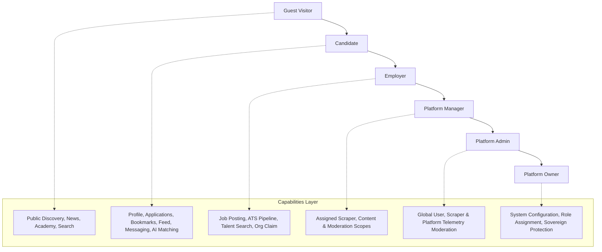

# Phase 30: Unified Access & RBAC Matrix

**Platform**: BerojgarDegreeWala  
**Audit Date**: August 28, 2026  
**Auditor**: Antigravity Pair-Programming Agent & RBAC Security Specialist  
**Design Principle**: Single Platform with Progressive Capability Layering (Not 3 Disjoint Apps)  

---

## 1. Persona & Capability Hierarchy

---

## 2. Multi-Role Capability Matrix

| Feature / Resource | Guest | Candidate | Employer | Manager | Admin | Owner |
| :--- | :---: | :---: | :---: | :---: | :---: | :---: |
| **Browse & Filter Opportunities** | ✅ Read | ✅ Read | ✅ Read | ✅ Read | ✅ Read | ✅ Read |
| **Read Semiconductor News & RSS** | ✅ Read | ✅ Read | ✅ Read | ✅ Read | ✅ Read | ✅ Read |
| **Access Learning Academy Tracks** | ✅ Read | ✅ Track Progress | ✅ Track Progress | ✅ Track Progress | ✅ Track Progress | ✅ Track Progress |
| **Public Profile Discovery** | ✅ Read | ✅ Read | ✅ Read | ✅ Read | ✅ Read | ✅ Read |
| **Basic AI Search / Questions** | ✅ (Rate-Limited) | ✅ Full | ✅ Full | ✅ Full | ✅ Full | ✅ Full |
| **Submit Job Applications** | ❌ (Redirect Login) | ✅ Create/Manage | ✅ Allowed | ✅ Allowed | ✅ Allowed | ✅ Allowed |
| **Save / Bookmark Opportunities** | ❌ (Redirect Login) | ✅ Full | ✅ Full | ✅ Full | ✅ Full | ✅ Full |
| **Professional Profile Management** | ❌ | ✅ Manage Own | ✅ Manage Own | ✅ Manage Own | ✅ Manage Own | ✅ Manage Own |
| **Post to Community Feed** | ❌ (Redirect Login) | ✅ Create/Edit/Delete Own | ✅ Create/Edit/Delete Own | ✅ Moderate All | ✅ Moderate All | ✅ Moderate All |
| **Send Direct Messages** | ❌ (Redirect Login) | ✅ Thread Scope | ✅ Candidate Reachout | ✅ Thread Scope | ✅ Thread Scope | ✅ Thread Scope |
| **Endorse Peer Skills** | ❌ | ✅ Peer Only | ✅ Peer Only | ✅ Peer Only | ✅ Peer Only | ✅ Peer Only |
| **Post & Manage Job Listings** | ❌ | ❌ (Role Gated) | ✅ Manage Org Jobs | ✅ Manage All | ✅ Manage All | ✅ Manage All |
| **ATS Applicant Tracking Kanban** | ❌ | ❌ | ✅ Manage Org Applicants | ✅ Assigned Scope | ✅ Manage All | ✅ Manage All |
| **Talent Search & Candidate Sourcing** | ❌ | ❌ | ✅ Full Access | ✅ Full Access | ✅ Full Access | ✅ Full Access |
| **Organization Profile & Team Settings**| ❌ | ❌ | ✅ Manage Own Org | ✅ Verify Orgs | ✅ Manage All | ✅ Manage All |
| **Scraper Operations & Ingestion** | ❌ | ❌ | ❌ | ⚠️ If Assigned | ✅ Run/Monitor | ✅ Full Control |
| **Platform Analytics & Telemetry** | ❌ | ❌ | ❌ (Own Analytics) | ⚠️ If Assigned | ✅ Global View | ✅ Full Control |
| **Role Assignment & Admin Permissions**| ❌ | ❌ | ❌ | ❌ | ❌ | ✅ Sovereign Authority |
| **System Secrets & Owner Protection** | ❌ | ❌ | ❌ | ❌ | ❌ | ✅ Sovereign Authority |

---

## 3. Manager Permission Groups

Managers receive explicitly assigned permission scopes rather than blanket administrative authority:

- `opportunities.read`, `opportunities.create`, `opportunities.update`, `opportunities.delete`
- `organizations.read`, `organizations.verify`, `organizations.update`
- `users.read`, `users.suspend`
- `content.read`, `content.moderate`
- `scrapers.read`, `scrapers.run`
- `analytics.read`

---

## 4. Sovereign Owner Protection Rules

1. **Non-Demotable**: The Owner account (`ADMIN_USERNAME` / Sovereign ID) cannot be modified, suspended, or demoted by any Manager or Admin.
2. **Self-Escalation Barrier**: Admins cannot grant themselves Owner capabilities.
3. **Audit Logged**: Any privileged administrative change generates immutable audit telemetry.
