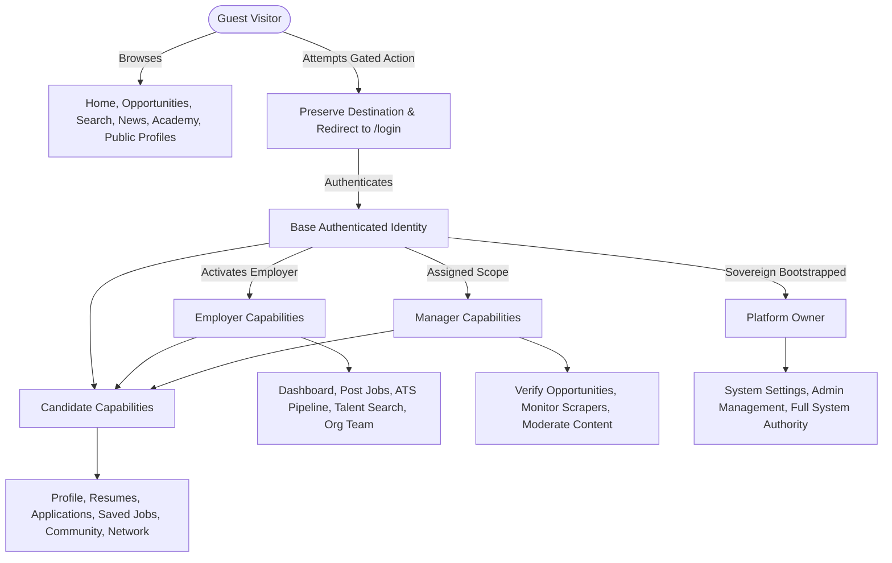

# Phase 30B: RBAC Implementation & Progressive Multi-Persona Audit

**Platform**: BerojgarDegreeWala  
**Audit Date**: August 28, 2026  
**Scope**: Unified Access Architecture, Progressive RBAC, Capability Resolution & Multi-Persona Support  
**Status**: **STAGE 1 COMPLETE & VERIFIED**

---

## 1. Executive Summary

Phase 30B implements a non-mutually-exclusive, capability-based access model across the entire platform. Rather than confining users to binary roles, the platform treats every authenticated user as a base identity who can progressively activate Candidate, Employer, and Manager capabilities.

### Key Tenets:
1. **Public by Default**: Guests can explore Home, Opportunities, Search, Details, News, Academy, and Public Profiles without being forced into login.
2. **Preserve-Destination Redirects**: Gated actions (Apply, Bookmark, Post, Connect, Message) preserve full destination URLs (including query params) and sanitize redirects via `getSafeRedirectUrl()` to prevent open redirect vulnerabilities.
3. **Additive Capabilities**: An Employer retains full access to Candidate features (Resume Studio, Applications, Networking, Saved Jobs) and Public features.
4. **Centralized Authority**: All authorization checks route through `@berojgardegreewala/api` and `frontend/src/lib/permissions.ts` (`hasRole`, `hasPermission`, `hasAnyPermission`, `hasOrganizationPermission`, `requirePermission`).

---

## 2. Capability Resolution Engine

---

## 3. API Authorization & RBAC Helpers

| Helper Function | Target Scope | Implementation Location |
| :--- | :--- | :--- |
| `hasRole(user, targetRole)` | Evaluates global platform role hierarchy (`owner > platform_admin > manager > user`) | `@berojgardegreewala/api`, `frontend/src/lib/permissions.ts` |
| `hasPermission(user, permission)` | Evaluates granular capability permissions | `@berojgardegreewala/api`, `frontend/src/lib/permissions.ts` |
| `hasAnyPermission(user, perms)` | Verifies if at least one permission in list is held | `@berojgardegreewala/api`, `frontend/src/lib/permissions.ts` |
| `hasOrganizationPermission(user, orgRole, perm)` | Organization-scoped RBAC (`org_owner`, `org_admin`, `hiring_manager`, `recruiter`) | `@berojgardegreewala/api`, `frontend/src/lib/permissions.ts` |
| `getSafeRedirectUrl(url, fallback)` | Sanitizes redirect URLs to prevent open redirects | `@berojgardegreewala/api`, `frontend/src/lib/permissions.ts` |
| `requirePermission(request, perm)` | Server-side route handler guard with fail-closed security | `frontend/src/lib/permissions.ts` |
| `requireAdmin(request)` | Admin API endpoint guard with timing-safe HMAC/password validation | `@berojgardegreewala/api`, `frontend/src/lib/admin-auth.ts` |
